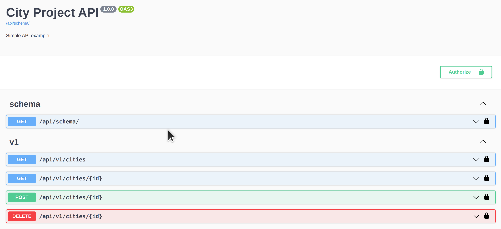

# REST API Cities application

This REST API provides the handler for showing, saving, fetching and managing city data. The application was implemented by test task documentation
for the vacancy of python developer.

## Get started
For launch this application you should be installed following requirements:
- Programming language is [Python 3.10.0](https://www.python.org/downloads/release/python-3100/).
- All dependencies install from `pip install -r requirements/requirements.txt --use-deprecated=legacy-resolver`.

This application uses google and yandex. You should register your application in services
- [Google](https://console.cloud.google.com/projectcreate?previousPage=%2Fprojectselector2%2Fgoogle%2Fmaps-apis%2Fcredentials%3F_ga%3D2.155322681.388134049.1644719244-2008333952.1644499982)
- [Yandex](https://yandex.com/dev/maps/geocoder/?from=mapsapi)

Declare default environment variables in .env file. Read more in [django-environ](https://django-environ.readthedocs.io/en/latest/):
- SECRET_KEY - secret key for a particular Django installation.
- DEBUG - debug mode.
- GOOGLE_API_KEY - Google map api key [Google create APi Key](https://console.cloud.google.com/google/maps-apis)
- GOOGLE_ELEVATION_API_KEY - Google map elevation api key [Google create APi Key](https://console.cloud.google.com/google/maps-apis)
- YANDEX_API_KEY - Yandex api key [Yandex create api key](https://yandex.com/dev/maps/geocoder/?from=mapsapi)
- ALLOW_HOST - allow application hosts

## How to use in local
Before run the application it recommends installing the virtual environment. In the Linux it can be doing like this:
```sh
python3 -m venv venv
source venv/bin/activate
```

Make a migration:
```sh
./manage.py migrate
```
And run application
```sh
./manage.py runserver
```

Also, you can make superuser for manage database used the admin page
```sh
./manage.py createsuperuser
```

You can check project using flake8
```sh
make style
```

## How to run in Docker

You have to installed [docker](https://docs.docker.com/) on your machine.

1. You need to bild docker image:
```bash
docker build -t cities_app .
```
2. You need to launch application by run the docker container by command
```shell
docker run --env-file .env -p 8000:8000 cities_app
```


## API Reference:

### URL Syntax
Cities application provides follow syntax of url (before deploy all examples based on localhost)

```sh
http://127.0.0.1:8000/api/v1/cities/<pk>[?<parameter=value>&<parameter=value>]
```

or if launch in docker:

```shell
http://0.0.0.0:8000/api/v1/cities/<pk>[?<parameter=value>&<parameter=value>]
```
where:

- `api/v1/cities/` - base url for access cities REST API resources.
- `pk` - id of city object in database.
- `[?<parameter=value>&<parameter=value>]` - query parameters for filtering cities query.

### Endpoints

| Endpoint name     | Endpoint | Endpoint type | Notes                                                               |
|-------------------|----------|---------------|---------------------------------------------------------------------|
| *Create city*     | `POST /cities` | `application/json` | Required parameters "title" (city name)                             |
| *All cities list* | `GET /cities` | `application/json` | Query parameters: **lat**=, **lon**=. Data should pass as int or float number |
| *Retreive city*   | `GET /cities/{city_id}` | `application/json` | Parameter: **city_id** |
| *Delete city*   | `DELETE /cities/{city_id}` | `application/json` | Parameter: **city_id** |

### Swagger schema

You can find swagger schema by url: 
```shell
http://127.0.0.1:8000/api/schema/swagger-ui
```

or if launch in docker:
```shell
http://0.0.0.0:8000/api/schema/swagger-ui
```


## License

You can copy, distribute and modify the software.